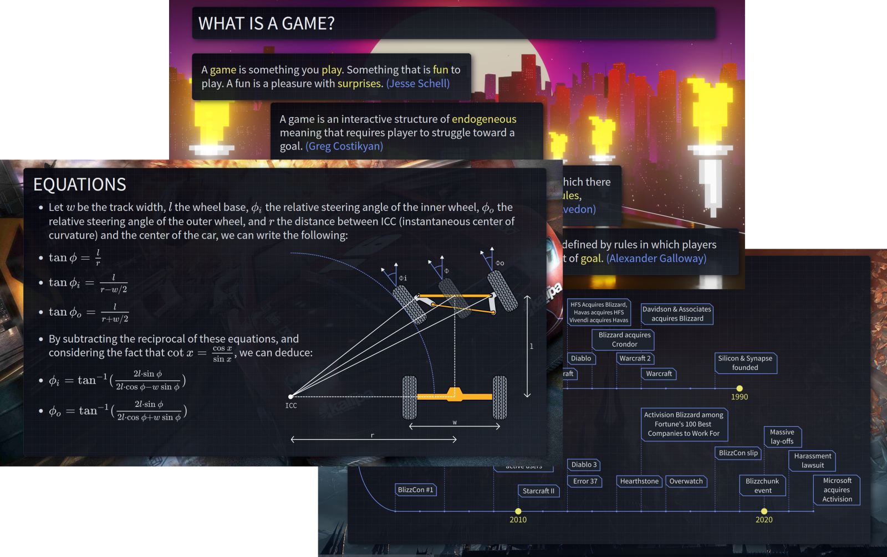

# APHGames Slides

- 🎓 lectures for [APHGames](https://aphgames.io) courses
- 🎈 declared by using DoDo's [Slides Template](https://github.com/dodolab/slides-template)
- 📦 bundled by using [parcelJS](https://parceljs.org) pipeline

## How to build this project
- clone it
- install [NodeJS](https://nodejs.org/en/download/), LTS version if possible 
- execute `npm install`
- run `npm run dev` and navigate to `localhost:1234/index.html`

Changelog is available [here](./CHANGELOG.md)

## Deployment
- the slides can be found on [aphgames.io](https://aphgames.io), materials tab

## License
- MIT License
- This license applies **only to the code** in this repository. Images, SVG files, and other assets are explicitly excluded!